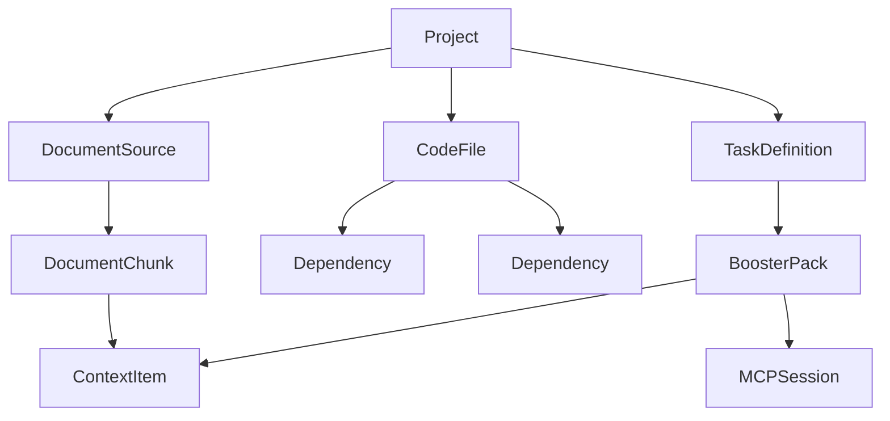
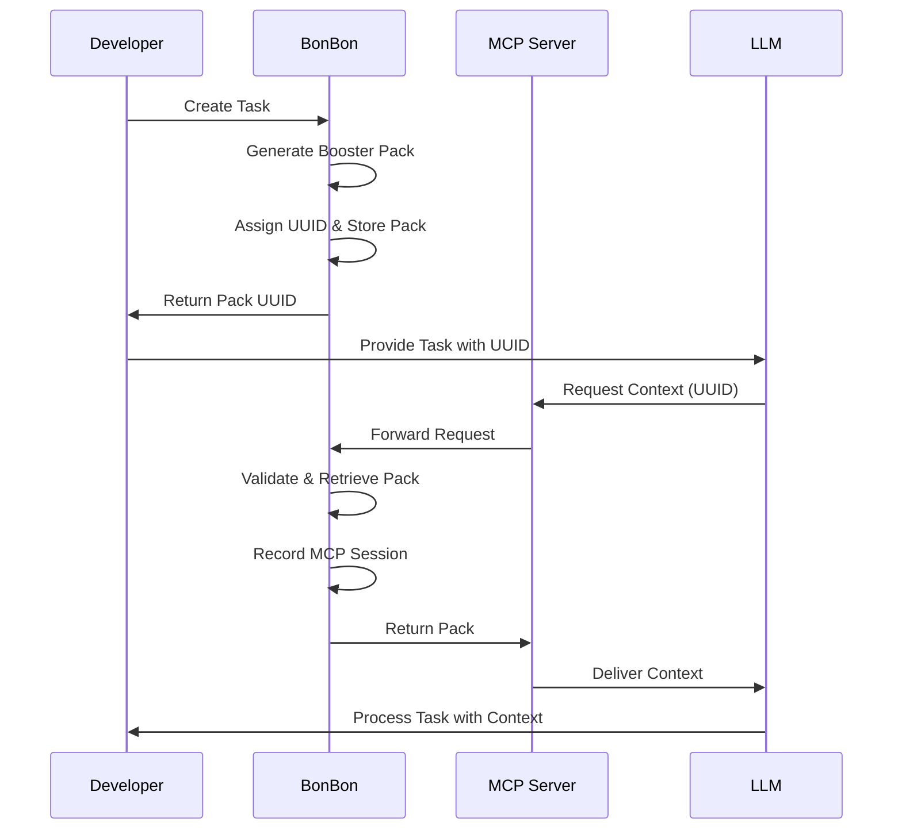

# BonBon: Data Model

*Related Documentation:*
- *System Context: [Software Architecture](software-architecture.md)*
- *AI Implementation: [AI Architecture](ai-architecture.md)*
- *Context Format: [Context Pack Format](context-pack.txt)*
- *Usage Examples: [User Stories](user-stories.md)*

## Core Data Entities

*For implementation requirements, see [Project Requirements](requirements.txt)*

### Project

Represents a code project under analysis.

```python
class Project:
    id: str  # UUID
    name: str
    root_path: str
    git_url: Optional[str]
    created_at: datetime
    updated_at: datetime
    settings: Dict[str, Any]
```

### DocumentSource

*Related: See [Static Analysis Tool](static-analysis-tool-prompt.md) for classification implementation*

Tracks origins of documentation and code.

```python
class DocumentSource:
    id: str  # UUID
    project_id: str  # Reference to Project
    name: str
    source_type: str  # "file", "url", "api", "git"
    location: str
    version: Optional[str]
    last_updated: datetime
```

### CodeFile

Represents a source code file in the project.

```python
class CodeFile:
    id: str  # UUID
    project_id: str  # Reference to Project
    path: str  # Relative to project root
    language: str
    last_modified: datetime
    is_indexed: bool
    token_count: int
    metadata: Dict[str, Any]
```

### DocumentChunk

Represents a chunk of code or documentation for vectorization.

```python
class DocumentChunk:
    id: str  # UUID
    source_id: str  # Reference to DocumentSource
    content: str
    chunk_type: str  # "code", "documentation"
    token_count: int
    embedding: Optional[List[float]]
```

### Dependency

Represents a relationship between code files.

```python
class Dependency:
    source_file_id: str  # Reference to CodeFile
    target_file_id: str  # Reference to CodeFile
    dependency_type: str  # "import", "reference", "inheritance"
```

### TaskDefinition

Defines a development task for context generation.

```python
class TaskDefinition:
    id: str  # UUID
    project_id: str  # Reference to Project
    description: str
    components: List[str]  # List of file paths
    created_at: datetime
    estimated_tokens: int
```

### BoosterPack

The generated context package for an LLM.

```python
class BoosterPack:
    id: str  # UUID
    task_id: str  # Reference to TaskDefinition
    created_at: datetime
    total_tokens: int
    instructions: str
    version: int
    target_model: str  # Model identifier
    expiration: datetime  # When this pack expires for MCP retrieval
    access_count: int  # Number of times retrieved
    last_accessed: Optional[datetime]
```

### ContextItem

Individual item included in a booster pack.

```python
class ContextItem:
    id: str  # UUID
    pack_id: str  # Reference to BoosterPack
    chunk_id: str  # Reference to DocumentChunk
    relevance_score: float
    inclusion_reason: str  # Why this was included
    token_count: int
```

### LLMConfig

Configuration for LLM models.

```python
class LLMConfig:
    id: str  # UUID
    name: str
    provider: str  # "openai", "anthropic", etc.
    model: str  # Specific model identifier
    api_key_reference: str  # Reference to key in secure storage
    parameters: Dict[str, Any]
    max_tokens: int
```

### MCPSession

Tracks MCP protocol sessions and access.

```python
class MCPSession:
    id: str  # UUID
    pack_id: str  # Reference to BoosterPack
    created_at: datetime
    expires_at: datetime
    api_key_hash: str  # Hashed API key for validation
    access_count: int
    last_accessed: Optional[datetime]
    client_info: Dict[str, Any]  # Information about the requesting client
    tool_type: str  # "claude-desktop", "claude-code", "vscode", "cursor", "windsurf", "github-copilot", etc.
    tool_version: Optional[str]
    format_preferences: Dict[str, Any]  # Tool-specific formatting preferences
    permissions: List[str]  # Specific access permissions for this session
```

### ToolIntegration

Defines configuration for specific tool integrations.

```python
class ToolIntegration:
    id: str  # UUID
    name: str  # "Claude Desktop", "VS Code Extension", etc.
    tool_type: str  # Identifier matching MCPSession.tool_type
    api_key_prefix: str  # Prefix for API keys issued to this tool
    max_session_hours: int  # Maximum TTL for sessions
    allowed_permissions: List[str]  # Permissions this tool can request
    adapter_config: Dict[str, Any]  # Tool-specific configuration
    created_at: datetime
    updated_at: datetime
    is_enabled: bool
```

## Relationships



## Storage Implementation

*Related: See [AI Architecture](ai-architecture.md#differentiable-search-and-reasoning) for search implementation details*

BonBon uses a hybrid storage approach:

### 1. DuckDB Database

*Related: See [Software Architecture](software-architecture.md#core-components) for system integration*

Used for structured data and relationships:
- Projects
- Tasks
- Code files
- Dependencies
- Booster packs
- LLM configurations
- MCP sessions

```python
import duckdb
from pydantic import BaseModel
from fastapi import FastAPI, Depends

# Database connection
conn = duckdb.connect("bonbon.duckdb")

# Create tables
conn.execute("""
CREATE TABLE projects (
    id VARCHAR PRIMARY KEY,
    name VARCHAR NOT NULL,
    root_path VARCHAR NOT NULL,
    git_url VARCHAR,
    created_at TIMESTAMP NOT NULL,
    updated_at TIMESTAMP NOT NULL,
    settings JSON
)
""")

conn.execute("""
CREATE TABLE document_sources (
    id VARCHAR PRIMARY KEY,
    project_id VARCHAR NOT NULL,
    name VARCHAR NOT NULL,
    source_type VARCHAR NOT NULL,
    location VARCHAR NOT NULL,
    version VARCHAR,
    last_updated TIMESTAMP NOT NULL,
    FOREIGN KEY (project_id) REFERENCES projects(id)
)
""")

# MCP sessions table
conn.execute("""
CREATE TABLE mcp_sessions (
    id VARCHAR PRIMARY KEY,
    pack_id VARCHAR NOT NULL,
    created_at TIMESTAMP NOT NULL,
    expires_at TIMESTAMP NOT NULL,
    api_key_hash VARCHAR NOT NULL,
    access_count INT DEFAULT 0,
    last_accessed TIMESTAMP,
    client_info JSON,
    FOREIGN KEY (pack_id) REFERENCES booster_packs(id)
)
""")

# Additional tables omitted for brevity
```

### 2. LanceDB Vector Database

*Related: See [AI Architecture](ai-architecture.md#probabilistic-code-representations) for embedding details*

Used for semantic search capabilities:
- Document chunks
- Embeddings
- Similarity search

```python
# Schema definition for LanceDB
code_chunks_schema = {
    "id": "string",
    "content": "string",
    "source_id": "string",
    "vector": "float[384]",  # For embedding vectors
    "token_count": "int32",
    "metadata": "json"
}

doc_chunks_schema = {
    "id": "string",
    "content": "string",
    "source_id": "string",
    "vector": "float[384]",  # For embedding vectors
    "token_count": "int32",
    "metadata": "json"
}
```

## MCP Protocol Data Flow

*Related: See [Software Architecture](software-architecture.md#mcp-server) for server implementation*

The MCP protocol introduces new data flows that are represented in the data model:



### MCP Session Management

The MCPSession entity tracks all aspects of MCP protocol usage:

1. **Authentication**: Validates API keys against stored hashes
2. **Access Control**: Ensures only authorized access to context packs
3. **Usage Metrics**: Tracks how often packs are retrieved and by whom
4. **Expiration**: Automatically expires packs after a configured time

```python
def validate_mcp_request(uuid: str, api_key: str) -> bool:
    """Validate an incoming MCP request"""
    # Hash the API key for comparison
    key_hash = hashlib.sha256(api_key.encode()).hexdigest()

    # Look up the session
    result = conn.execute("""
        SELECT s.id, p.expires_at
        FROM mcp_sessions s
        JOIN booster_packs p ON s.pack_id = p.id
        WHERE s.id = ? AND s.api_key_hash = ? AND p.expires_at > CURRENT_TIMESTAMP
    """, [uuid, key_hash]).fetchone()

    if result:
        # Update access statistics
        conn.execute("""
            UPDATE mcp_sessions
            SET access_count = access_count + 1, last_accessed = CURRENT_TIMESTAMP
            WHERE id = ?
        """, [uuid])
        return True

    return False
```

## Token Optimization Strategies

The data model supports sophisticated token management:

1. **Chunk-Level Tracking**: Each document chunk tracks its token count
2. **File-Level Estimation**: CodeFile maintains overall token count
3. **Pack Budget Allocation**: BoosterPack carefully tracks total tokens
4. **Model-Specific Limits**: LLMConfig defines max_tokens for targeted optimization
5. **Progressive Loading**: Allow dynamically requesting additional context when needed

## Schema Migration Approach

As BonBon evolves, the data model will need to change. The strategy:

1. **Version Tracking**: Each schema has a version number
2. **Migration Scripts**: Automated updates between versions
3. **Backward Compatibility**: Support reading older schema versions
4. **Data Validation**: Ensure data integrity during migrations

## Security Considerations

The data model addresses security through:

1. **API Key References**: Indirect references to keys stored in secure storage
2. **Key Hashing**: API keys are stored as hashes, not plaintext
3. **Data Segregation**: Clear project boundaries for multi-project usage
4. **Minimal Permissions**: Store only what's needed for functionality
5. **Access Logging**: All MCP requests are logged for audit purposes

## MCP Implementation Example

```python
import uuid
import hashlib
import duckdb
import lancedb
from datetime import datetime, timedelta
from pydantic import BaseModel, Field
from typing import List, Optional, Dict, Any
import json
from fastapi import FastAPI, Depends, HTTPException, Header

app = FastAPI()
conn = duckdb.connect("bonbon.duckdb")

class MCPRequest(BaseModel):
    uuid: str
    client_info: Dict[str, Any] = {}

class MCPResponse(BaseModel):
    task: Dict[str, Any]
    code_chunks: List[Dict[str, Any]]
    doc_chunks: List[Dict[str, Any]]
    instructions: str

@app.post("/api/v1/context/{uuid}")
async def get_context(
    uuid: str,
    request: MCPRequest,
    authorization: str = Header(None)
):
    # Extract API key from Bearer token
    if not authorization or not authorization.startswith("Bearer "):
        raise HTTPException(status_code=401, detail="Invalid authorization header")

    api_key = authorization.replace("Bearer ", "")

    # Validate the request
    if not validate_mcp_request(uuid, api_key):
        raise HTTPException(status_code=403, detail="Invalid or expired context pack")

    # Retrieve the booster pack
    pack = get_booster_pack(uuid)
    if not pack:
        raise HTTPException(status_code=404, detail="Context pack not found")

    # Update client info
    update_client_info(uuid, request.client_info)

    # Return the pack
    return MCPResponse(
        task=pack["task"],
        code_chunks=pack["code_chunks"],
        doc_chunks=pack["doc_chunks"],
        instructions=pack["instructions"]
    )

def validate_mcp_request(uuid: str, api_key: str) -> bool:
    """Validate MCP request against stored sessions"""
    key_hash = hashlib.sha256(api_key.encode()).hexdigest()

    result = conn.execute("""
        SELECT s.id
        FROM mcp_sessions s
        JOIN booster_packs p ON s.pack_id = p.id
        WHERE s.id = ? AND s.api_key_hash = ? AND p.expires_at > CURRENT_TIMESTAMP
    """, [uuid, key_hash]).fetchone()

    return result is not None

def get_booster_pack(uuid: str) -> Optional[Dict[str, Any]]:
    """Retrieve a booster pack by UUID"""
    # Update access statistics
    conn.execute("""
        UPDATE mcp_sessions
        SET access_count = access_count + 1, last_accessed = CURRENT_TIMESTAMP
        WHERE id = ?
    """, [uuid])

    # Get the pack data
    result = conn.execute("""
        SELECT p.*, t.description as task_description, t.components
        FROM booster_packs p
        JOIN tasks t ON p.task_id = t.id
        WHERE p.id = ?
    """, [uuid]).fetchone()

    if not result:
        return None

    # Get the context items
    code_chunks = conn.execute("""
        SELECT c.*, d.content, d.source
        FROM context_items c
        JOIN document_chunks d ON c.chunk_id = d.id
        WHERE c.pack_id = ? AND d.chunk_type = 'code'
        ORDER BY c.relevance_score DESC
    """, [uuid]).fetchall()

    doc_chunks = conn.execute("""
        SELECT c.*, d.content, d.source
        FROM context_items c
        JOIN document_chunks d ON c.chunk_id = d.id
        WHERE c.pack_id = ? AND d.chunk_type = 'documentation'
        ORDER BY c.relevance_score DESC
    """, [uuid]).fetchall()

    # Format the response
    return {
        "task": {
            "description": result["task_description"],
            "components": json.loads(result["components"])
        },
        "code_chunks": [
            {
                "source": chunk["source"],
                "content": chunk["content"],
                "relevance_score": chunk["relevance_score"],
                "metadata": json.loads(chunk["metadata"]) if chunk["metadata"] else {}
            }
            for chunk in code_chunks
        ],
        "doc_chunks": [
            {
                "source": chunk["source"],
                "content": chunk["content"],
                "relevance_score": chunk["relevance_score"],
                "metadata": json.loads(chunk["metadata"]) if chunk["metadata"] else {}
            }
            for chunk in doc_chunks
        ],
        "instructions": result["instructions"]
    }

def update_client_info(uuid: str, client_info: Dict[str, Any]):
    """Update client information for a session"""
    conn.execute("""
        UPDATE mcp_sessions
        SET client_info = ?
        WHERE id = ?
    """, [json.dumps(client_info), uuid])

def create_mcp_session(pack_id: str, api_key: str, ttl_hours: int = 24) -> str:
    """Create a new MCP session for a booster pack"""
    session_id = str(uuid.uuid4())
    key_hash = hashlib.sha256(api_key.encode()).hexdigest()
    expires_at = datetime.now() + timedelta(hours=ttl_hours)

    conn.execute("""
        INSERT INTO mcp_sessions (id, pack_id, created_at, expires_at, api_key_hash, access_count)
        VALUES (?, ?, ?, ?, ?, 0)
    """, [session_id, pack_id, datetime.now(), expires_at, key_hash])

    return session_id
```

## Full Data Flow Example

Below is a comprehensive example showing how the data model supports the entire BonBon workflow, including MCP protocol integration:

```python
import uuid
import hashlib
import duckdb
import lancedb
from datetime import datetime, timedelta
from pydantic import BaseModel, Field
from typing import List, Optional, Dict, Any
import json
from sentence_transformers import SentenceTransformer
import tiktoken

# Initialize connections
duckdb_conn = duckdb.connect("bonbon.duckdb")
lance_db = lancedb.connect("lance_storage")
embedding_model = SentenceTransformer('all-MiniLM-L6-v2')
token_encoder = tiktoken.encoding_for_model("gpt-4")

def complete_bonbon_workflow():
    """Demonstrate a complete workflow from project setup to MCP retrieval"""

    # 1. Create a project
    project_id = str(uuid.uuid4())
    project_name = "BonBon"
    root_path = "/Users/developer/projects/bonbon"

    duckdb_conn.execute("""
        INSERT INTO projects (id, name, root_path, created_at, updated_at, settings)
        VALUES (?, ?, ?, ?, ?, ?)
    """, [
        project_id,
        project_name,
        root_path,
        datetime.now(),
        datetime.now(),
        json.dumps({"token_budget": 8000})
    ])

    # 2. Index code files
    code_file_ids = []
    for file_path in ["src/core_engine.py", "src/api_layer.py"]:
        file_id = str(uuid.uuid4())
        code_file_ids.append(file_id)

        with open(f"{root_path}/{file_path}", "r") as f:
            content = f.read()

        token_count = len(token_encoder.encode(content))

        duckdb_conn.execute("""
            INSERT INTO code_files (id, project_id, path, language, last_modified, is_indexed, token_count, metadata)
            VALUES (?, ?, ?, ?, ?, ?, ?, ?)
        """, [
            file_id,
            project_id,
            file_path,
            "python",
            datetime.now(),
            True,
            token_count,
            json.dumps({"lines": content.count("\n") + 1})
        ])

        # Create document chunks and embeddings
        chunks = [content]  # In practice, would split into semantic chunks
        for i, chunk in enumerate(chunks):
            chunk_id = str(uuid.uuid4())
            embedding = embedding_model.encode(chunk)

            # Store in LanceDB
            table = lance_db.open_table("code_chunks")
            table.add({
                "id": chunk_id,
                "content": chunk,
                "source_id": file_id,
                "vector": embedding.tolist(),
                "token_count": len(token_encoder.encode(chunk)),
                "metadata": json.dumps({"index": i, "is_code": True})
            })

            # Store reference in DuckDB
            duckdb_conn.execute("""
                INSERT INTO document_chunks (id, source_id, content, chunk_type, token_count, embedding_id)
                VALUES (?, ?, ?, ?, ?, ?)
            """, [
                chunk_id,
                file_id,
                chunk,
                "code",
                len(token_encoder.encode(chunk)),
                chunk_id  # Reference to LanceDB
            ])

    # 3. Create a task
    task_id = str(uuid.uuid4())
    task_description = "Implement MCP protocol handler"
    components = ["src/core_engine.py"]

    duckdb_conn.execute("""
        INSERT INTO tasks (id, project_id, description, components, created_at, estimated_tokens)
        VALUES (?, ?, ?, ?, ?, ?)
    """, [
        task_id,
        project_id,
        task_description,
        json.dumps(components),
        datetime.now(),
        3000  # Estimated tokens
    ])

    # 4. Generate a booster pack
    pack_id = str(uuid.uuid4())

    duckdb_conn.execute("""
        INSERT INTO booster_packs (id, task_id, created_at, total_tokens, instructions, version, target_model, expiration)
        VALUES (?, ?, ?, ?, ?, ?, ?, ?)
    """, [
        pack_id,
        task_id,
        datetime.now(),
        2500,  # Actual tokens used
        "Here's the context for implementing the MCP protocol handler...",
        1,
        "gpt-4",
        datetime.now() + timedelta(days=7)  # Expires in 7 days
    ])

    # 5. Associate relevant chunks with the pack
    relevant_chunks = duckdb_conn.execute("""
        SELECT id, token_count FROM document_chunks
        WHERE source_id IN (
            SELECT id FROM code_files
            WHERE project_id = ? AND path IN ?
        )
    """, [project_id, json.dumps(components)]).fetchall()

    for chunk in relevant_chunks:
        context_item_id = str(uuid.uuid4())

        duckdb_conn.execute("""
            INSERT INTO context_items (id, pack_id, chunk_id, relevance_score, inclusion_reason, token_count)
            VALUES (?, ?, ?, ?, ?, ?)
        """, [
            context_item_id,
            pack_id,
            chunk["id"],
            0.95,  # High relevance
            "direct_component",
            chunk["token_count"]
        ])

    # 6. Generate an MCP session
    api_key = "test-api-key-12345"
    session_id = create_mcp_session(pack_id, api_key, ttl_hours=48)

    print(f"Generated MCP session: {session_id}")
    print(f"This UUID can be provided to an LLM for context retrieval")

    # 7. Simulate MCP retrieval
    mcp_request_validation = validate_mcp_request(session_id, api_key)
    if mcp_request_validation:
        pack_data = get_booster_pack(session_id)
        print(f"Successfully retrieved pack with {len(pack_data['code_chunks'])} code chunks")
    else:
        print("MCP validation failed")

    return session_id
```

This comprehensive data model ensures BonBon can efficiently manage context for LLMs while providing secure, on-demand access through the MCP protocol.
