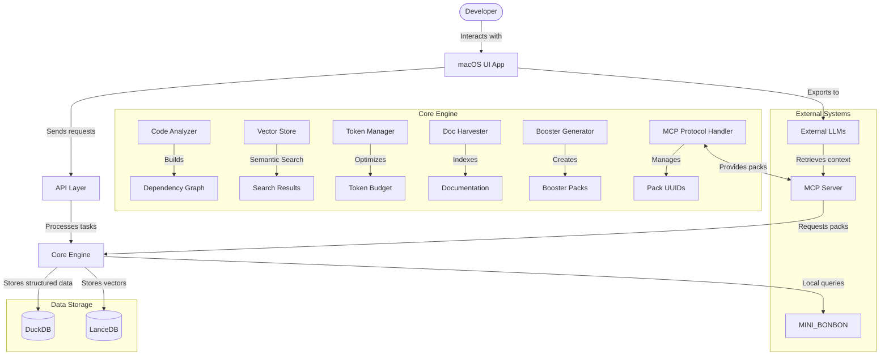
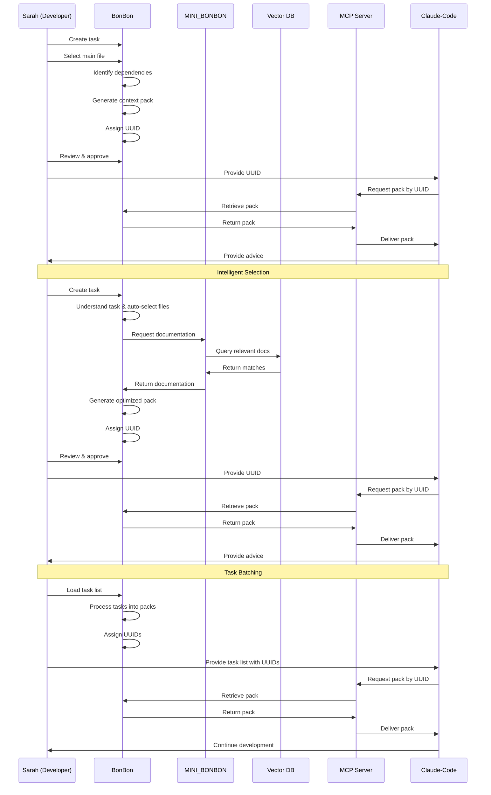
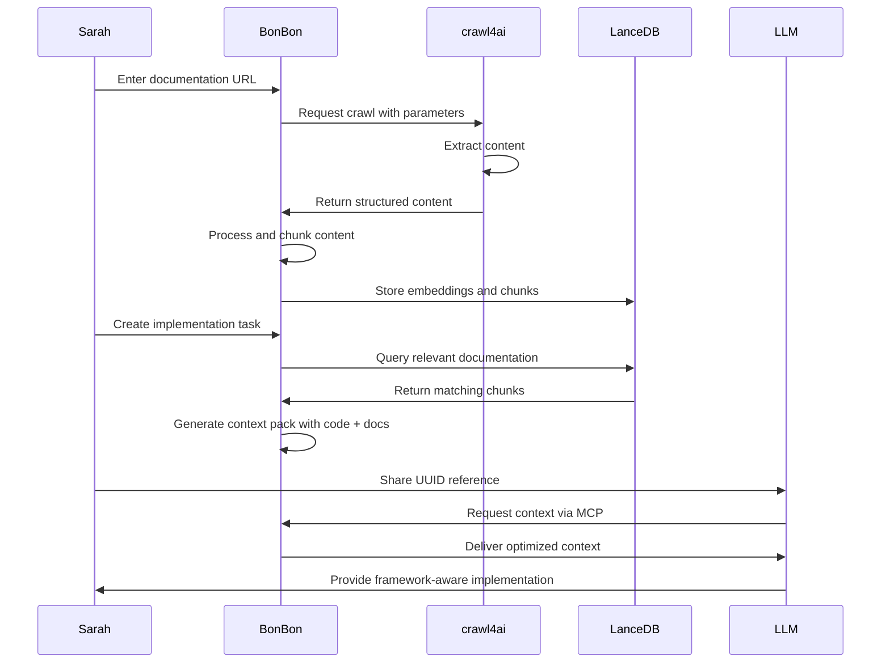
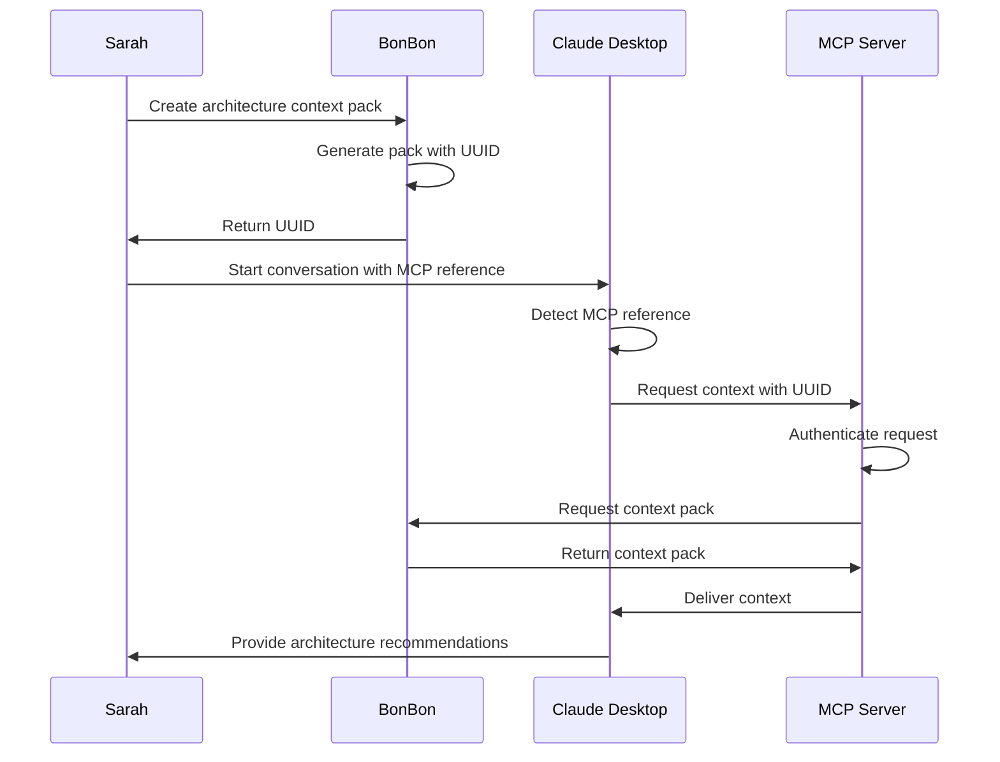
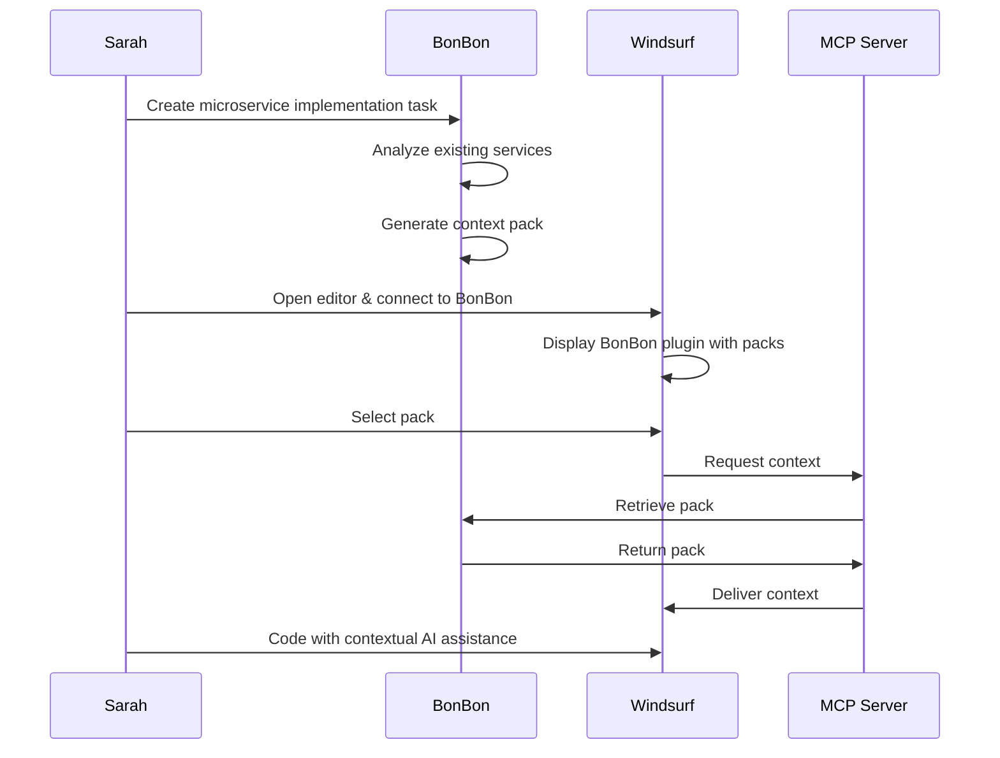

# BonBon: User Stories

## System Architecture Overview



## Personas

### Sarah - Senior Backend Developer
Sarah leads a team developing complex distributed systems. She has 12+ years of experience and has become an expert at leveraging LLMs for specific coding tasks. She's frustrated by how often she has to manually gather context from multiple files when asking for help with architecture decisions or refactoring.

### Miguel - Junior Frontend Developer
Miguel joined the company six months ago and is still getting familiar with their large codebase. He relies heavily on LLMs to understand existing patterns and implement new features correctly. He spends significant time trying to provide enough context in his prompts.

### Priya - Technical Product Manager
Priya bridges the gap between business requirements and technical implementation. While not primarily a programmer, she has baseline coding knowledge. She uses LLMs to draft technical specifications and documentation, but struggles to include the right technical context.

## User Stories

### Sarah - Refactoring Complex Components

**Context:** Sarah needs to refactor a database access layer that's grown organically over two years and has become difficult to maintain.

**Current Workflow:**
1. Manually identifies 8-10 files that compose the database layer
2. Copies relevant code sections into her LLM prompt
3. Tries to explain the overall architecture in text
4. Asks for refactoring advice
5. Gets incomplete advice because she couldn't include all context due to token limitations
6. Makes multiple follow-up queries with additional context

**BonBon Basic Workflow:**
1. Opens the project in BonBon
2. Creates a new task: "Refactor database access layer to improve maintainability"
3. Selects the main database access file
4. BonBon automatically identifies dependencies and related files
5. BonBon generates a context pack optimized for token usage
6. BonBon assigns a UUID to the pack and stores it for retrieval
7. Sarah reviews and approves the pack
8. Sarah requests the UUID for use with Claude-Code
9. Claude-Code retrieves the pack via MCP server using the UUID
10. LLM provides comprehensive refactoring advice with full understanding of the codebase

**BonBon Intelligent Selection Workflow:**
1. Opens the project in BonBon
2. Creates a new task: "Refactor database access layer to improve maintainability"
3. BonBon understands what this means and invokes shell commands to automatically select the important information from the codebase
4. BonBon automatically identifies dependencies and related files
5. BonBon checks its developer documentation collection and sends a request to MINI_BONBON (a locally hosted small LLM)
6. MINI_BONBON talks with the LanceDB vector store to collect content matching the scope of work from documentation for relevant languages, libraries, and tools
7. BonBon generates a context pack optimized for token usage
8. BonBon assigns a UUID to the pack and stores it for retrieval
9. Sarah reviews and approves the pack
10. Sarah requests the UUID for use with Claude-Code
11. Claude-Code retrieves the pack via MCP server using the UUID
12. LLM provides comprehensive refactoring advice with full understanding of the codebase

**BonBon Task Batching Workflow:**
1. Opens the project in BonBon
2. Loads a task list with multiple items including "Refactor database access layer to improve maintainability"
3. BonBon iteratively processes each task to assemble booster packs
4. Each pack is identified by a UUID which can be reinserted in the task list shared with the LLM
5. When the LLM reads the task list, it sees it needs to reach out to BonBon through the MCP server connection
6. The LLM hands the MCP server the UUID
7. The MCP server forwards the request to BonBon
8. BonBon validates the request and returns the appropriate booster pack
9. The MCP server delivers the context to the LLM
10. LLM continues development with complete context for each task

**Value:** Sarah saves 30+ minutes of context gathering and receives higher quality advice since the LLM understands the complete picture. The advanced workflows further reduce manual selection and integrate seamlessly with her development environment.

```
"With BonBon, I can focus on evaluating architectural options instead of spending half an hour just trying to give the LLM enough context to be useful. The intelligent selection and task batching features make it feel like having a senior architect who already knows our codebase inside out."
```



### Miguel - Understanding Component Interactions

**Context:** Miguel needs to add a new feature to the user authentication flow, which touches multiple components he's unfamiliar with.

**Current Workflow:**
1. Uses grep/search to find files related to authentication
2. Reviews each file trying to understand the flow
3. Copies what he thinks are relevant sections to an LLM
4. Asks how the components interact
5. Gets partially helpful responses that miss important connections
6. Makes multiple attempts with different context selections
7. Eventually builds a mental model after significant back-and-forth

**BonBon Workflow:**
1. Opens BonBon and searches for "user authentication"
2. BonBon finds relevant files based on semantic search
3. Creates a task: "Understand user authentication flow for feature addition"
4. BonBon generates a context pack with key components and their relationships
5. Reviews and approves the context pack
6. BonBon generates a UUID and stores the pack
7. Miguel shares the UUID with his preferred LLM
8. LLM retrieves the context through the MCP server
9. Receives a comprehensive explanation including component interactions
10. Immediately understands where and how to implement his feature

**Value:** Miguel reduces learning curve time by 70% and gains confidence in making changes to unfamiliar code.

```
"BonBon is like having a senior developer who can instantly show me exactly which pieces of our codebase I need to understand. I'm spending way less time feeling lost in the codebase and more time actually building features."
```

### Priya - Technical Specification Development

**Context:** Priya needs to create a technical specification for a new reporting feature that will integrate with their existing analytics pipeline.

**Current Workflow:**
1. Schedules meetings with developers to understand the current analytics system
2. Takes notes on technical components discussed
3. Attempts to copy/paste code snippets developers share with her
4. Uses an LLM to help draft the specification
5. Specification has gaps around technical details
6. Requires multiple review cycles with engineers to correct inaccuracies

**BonBon Workflow:**
1. Opens BonBon and creates a task: "Draft technical specification for new reporting feature"
2. Selects the main analytics pipeline components (with guidance from a developer)
3. BonBon generates a context pack with the right level of technical detail
4. BonBon assigns a UUID to the context pack
5. Priya copies the UUID into her preferred LLM along with specification requirements
6. LLM retrieves the context via MCP and generates a draft specification
7. The specification accurately reflects system capabilities
8. Shares specification with engineers who need minimal corrections

**Value:** Priya creates more accurate technical specifications with fewer engineering resources and review cycles.

```
"BonBon gives me the confidence to create technical documents without constantly worrying if I've misunderstood how something works. It lets me be more self-sufficient while still producing technically accurate specifications."
```

### Sarah - Documentation Harvesting and Integration

**Context:** Sarah needs to incorporate a third-party framework's documentation into her project context to help her team use it correctly.

**Current Workflow:**
1. Manually navigates to the framework's documentation site
2. Reads through various sections to identify relevant parts
3. Copies sections into a document or directly into LLM prompts
4. Struggles with determining how much documentation to include
5. Misses important details due to token limitations
6. Has to repeatedly refer back to the documentation site for additional information

**BonBon Workflow:**
1. Opens BonBon and selects "Harvest Documentation"
2. Enters the URL of the framework's documentation homepage
3. Specifies crawl parameters (depth, section filters, etc.)
4. BonBon integrates with crawl4ai to extract and process the documentation
5. Documentation is automatically chunked into semantic units
6. Chunks are embedded and stored in LanceDB with source metadata
7. BonBon indexes the documentation and adds it to the project's context
8. Sarah creates a new task related to the framework
9. BonBon automatically includes relevant documentation chunks in context packs
10. When retrieving via MCP, LLMs get precisely the documentation they need

**Value:** Eliminates manual documentation harvesting, ensures complete coverage, and makes framework expertise available throughout the development process.



```
"Documentation used to be a separate silo that I had to manually bridge for LLMs. With BonBon's harvesting capabilities, all that documentation becomes a seamless part of the context. It's like having a team member who's read every page of the docs and knows exactly what's relevant to my current task."
```

### Miguel - Debugging Complex Issues

**Context:** Miguel encounters a bug in the application's state management that spans multiple components.

**Current Workflow:**
1. Identifies error message and where it occurs
2. Tries to backtrack through the code to find potential causes
3. Sends stack trace and immediately related code to an LLM
4. Gets generic advice due to limited context
5. Struggles to provide enough relevant code without overwhelming the token limit
6. Makes slow progress through trial and error

**BonBon Workflow:**
1. Opens BonBon and creates a task: "Debug state management error in checkout flow"
2. Includes the file where the error occurs
3. BonBon identifies dependency chain and state management components
4. Generates a context pack with the relevant error handling and state management code
5. Assigns a UUID to the pack with a 24-hour access window
6. Miguel provides the UUID to his preferred LLM along with error details
7. LLM retrieves the context through the MCP server
8. Receives specific debugging advice that understands the complete state flow

**Value:** Miguel resolves complex bugs faster by giving LLMs a complete picture of the relevant code paths.

```
"Before BonBon, debugging across components was my least favorite task. Now, I can quickly get the AI to understand exactly how our state flows through different parts of the app without having to become an expert in every component first."
```

## MCP Integration Use Cases

### Contextual Task Lists

**Context:** Sarah is planning a sprint with multiple related tasks that need to be completed in sequence.

**BonBon Workflow:**
1. Creates multiple task definitions in BonBon for different aspects of the sprint
2. BonBon generates a context pack for each task
3. Each pack receives a unique UUID for MCP retrieval
4. Sarah creates a task list document with embedded UUIDs
5. Provides the task list to Claude-Code
6. As Claude-Code processes each task, it retrieves the relevant context through MCP
7. Claude-Code maintains a coherent understanding of the overall project while accessing task-specific details

**Value:** Enables complex multi-task workflows without overwhelming token contexts.

### Continuous Context

**Context:** Miguel is having an extended working session with an LLM to implement a new feature.

**BonBon Workflow:**
1. Creates a task in BonBon for the feature implementation
2. BonBon generates a context pack and assigns a UUID
3. Miguel shares the UUID with the LLM
4. Throughout the conversation, the LLM can access the context pack through MCP
5. As implementation progresses, Miguel updates the context pack in BonBon
6. The LLM continues to access the latest context through the same UUID
7. The conversation maintains continuity while the context evolves

**Value:** Provides a persistent, updatable context that spans multiple conversation turns.

## Tool Integration Use Cases

### Claude Desktop Integration

**Context:** Sarah needs to draft a significant architecture update for her team's backend service.

**Integration Flow:**
1. Sarah creates a context pack in BonBon for the architecture overhaul task
2. BonBon generates a UUID for the pack and shares it via clipboard
3. Sarah opens Claude Desktop and creates a new conversation
4. She includes the UUID reference in her initial prompt: `[MCP:37de2a8f-1429-47b9-a994-7d56870c8c3d]`
5. Claude Desktop detects the MCP reference and displays an indicator that context is available
6. Claude connects to the MCP server and requests the context
7. The MCP server authenticates Claude Desktop using API keys configured during setup
8. MCP server retrieves the context from BonBon and delivers it to Claude
9. Claude uses the rich context to provide detailed architecture recommendations
10. Sarah can continue the conversation with Claude having full knowledge of the codebase

**Value:** Eliminates context copy-paste while maintaining Claude Desktop's conversational UI experience for complex architectural discussions.



### Claude-Code Terminal Integration

**Context:** Miguel needs to debug a complex issue that spans multiple files in the codebase.

**Integration Flow:**
1. Miguel identifies the error in the application
2. Opens BonBon and creates a task: "Debug auth token refresh issue"
3. BonBon identifies relevant files, the error handling flow, and token management
4. BonBon generates a context pack and UUID
5. Miguel opens his terminal and runs Claude-Code
6. He provides the command: `claude-code debug --context mcp:45ab73c2-ffcc-4e3d-b55d-2a3e0987dcf1`
7. Claude-Code connects to the MCP server with pre-configured API keys
8. MCP server verifies Claude-Code's identity using mutual TLS authentication
9. Context is retrieved from BonBon and delivered to Claude-Code
10. Claude-Code provides detailed debugging suggestions in the terminal
11. Miguel can interactively work through the debugging process with Claude-Code

**Value:** Provides seamless context integration for terminal workflows, enabling comprehensive debugging without leaving the command line.

### Cursor IDE Integration

**Context:** Priya is updating API documentation and needs to ensure technical accuracy.

**Integration Flow:**
1. Priya opens the project in BonBon and creates a task: "Update payment API documentation"
2. BonBon generates a context pack with API implementation files and existing docs
3. BonBon provides a UUID and also a Cursor-specific snippet
4. Priya opens the documentation file in Cursor IDE
5. She pastes the snippet as a comment at the top of the file:
   ```
   // @bonbon-context: 67cd9a12-88ef-4abe-9f54-123456789abc
   ```
6. When she invokes Cursor's AI features with Cmd+K, Cursor detects the BonBon context reference
7. Cursor connects to the MCP server using stored credentials
8. MCP server validates the request and retrieves the context from BonBon
9. Cursor incorporates the context into its AI queries
10. Priya receives technically accurate documentation suggestions based on actual implementation

**Value:** Enhances IDE-integrated AI with deep codebase understanding while maintaining a focused workflow.

### Windsurf Code Editor Integration

**Context:** Sarah is implementing a new microservice that needs to follow existing architectural patterns.

**Integration Flow:**
1. Sarah defines a new service implementation task in BonBon
2. BonBon analyzes existing microservices and architectural documentation
3. BonBon creates a context pack with relevant examples and patterns
4. Sarah opens Windsurf editor and connects it to BonBon via the MCP plugin
5. The Windsurf BonBon plugin displays a list of available context packs
6. Sarah selects the microservice implementation pack
7. Windsurf's AI features now have access to the architectural patterns
8. As Sarah codes, she can ask Windsurf AI contextual questions
9. Windsurf maintains the context throughout the development session
10. The implementation consistently follows existing architectural patterns

**Value:** Provides continuous architectural guidance during development without requiring context switching.



### VS Code Extension Integration

**Context:** Miguel needs to refactor a complex class while preserving all existing behavior.

**Integration Flow:**
1. Miguel identifies the class that needs refactoring
2. He right-clicks the file in VS Code and selects "Create BonBon Context"
3. The BonBon VS Code extension invokes the BonBon API
4. BonBon analyzes the class, its dependencies, and usage patterns
5. BonBon creates a context pack and makes it available via MCP
6. The VS Code extension receives the UUID and stores it in workspace metadata
7. Miguel invokes the VS Code AI features with Ctrl+Shift+P
8. VS Code AI connects to the MCP server to retrieve the context
9. The AI provides refactoring suggestions with awareness of all dependencies
10. Miguel can query specific aspects of the refactoring without losing context

**Value:** Integrates BonBon capabilities directly into the IDE workflow with minimal friction.

### GitHub Copilot Integration

**Context:** Sarah is working on a pull request that implements a complex algorithm.

**Integration Flow:**
1. Sarah creates a context pack in BonBon focused on algorithm implementation
2. BonBon provides a GitHub Copilot-compatible annotation format
3. Sarah adds a special comment in her code:
   ```
   // @github-copilot context-from: bonbon:89ef2a56-7731-4c02-9864-1a2bc35d8f7e
   ```
4. GitHub Copilot detects the annotation and connects to the MCP server
5. MCP server validates the request using OAuth credentials
6. Context is retrieved from BonBon and incorporated into Copilot's model
7. Copilot suggests algorithm implementations that align with the project's patterns
8. As Sarah works, Copilot maintains awareness of the algorithm's requirements and edge cases

**Value:** Enhances GitHub Copilot's suggestions with deep understanding of complex algorithmic requirements.

### CI/CD Pipeline Integration

**Context:** The team needs to automate API documentation generation during builds.

**Integration Flow:**
1. DevOps engineer creates a BonBon context pack for API documentation
2. The pack includes all controller classes, data models, and existing documentation
3. A GitHub Action is configured to use the MCP protocol:
   ```yaml
   - name: Generate API Documentation
     uses: bonbon-actions/generate-docs@v1
     with:
       mcp-uuid: ${{ secrets.BONBON_API_DOCS_UUID }}
       output-path: ./docs/api
   ```
4. When the pipeline runs, the action connects to MCP server
5. MCP server authenticates using GitHub's OIDC tokens
6. Context is retrieved and used to generate comprehensive documentation
7. Documentation accurately reflects the current API implementation

**Value:** Enables automated documentation generation with deep understanding of the API's implementation details.
